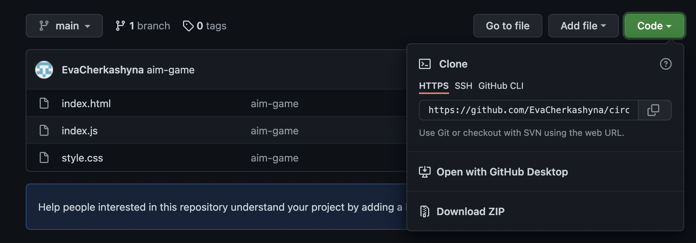

<h1 style="text-align : center; font-size:40px; line-height: 20px">Slider</h1>
<hr>

# Description

This Is A Photo Slider Implemented in Java Script. A mini project that can be used on various large projects and in various configurations.

# Objective
The purpose of creating this project was to learn different elements and practice in JavaScript.

+ practice with linking ***CSS*** and ***JS***
+ working with ***DOM*** ***tree*** in JS
+ keyboard and button ***binding*** ***practice***
+ work with ***functions***
+ working with page ***animation*** with CSS
```JS
function slideIt(direction) {
    if (direction === 'up') {
        activeSlideIndex++;
        if (activeSlideIndex === slideCount) {
            activeSlideIndex = 0;
        }
    }
    else if (direction == 'down') {
        activeSlideIndex--;
        if (activeSlideIndex < 0) {
            activeSlideIndex = slideCount-1;
        }
    }
    const height = container.clientHeight
    mainSlide.style.transform=`translateY(-${activeSlideIndex*height}px)`;
    sidebar.style.transform=`translateY( ${activeSlideIndex*height}px)`;
}
```
# How it works

To view the pictures, just click on the arrow buttons or press the `up` or `down` keys.


# Live Demo

For the convenience of viewing my project, follow the instructions:

+ after clicking on the link, enlarge the project window, as shown in the video
+ press the `RUN` button in the top left corner and enjoy!  [Slider-link](https://jsfiddle.net/5yz96xjo/)


# Download instructions

1. Copy the link you can find by clicking on the green `code` button.
2. Write in terminal: `git clone link`.
3. The project will be copied to the selected folder.